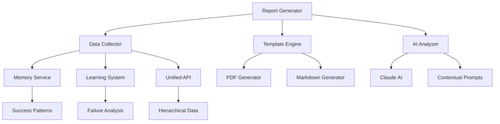
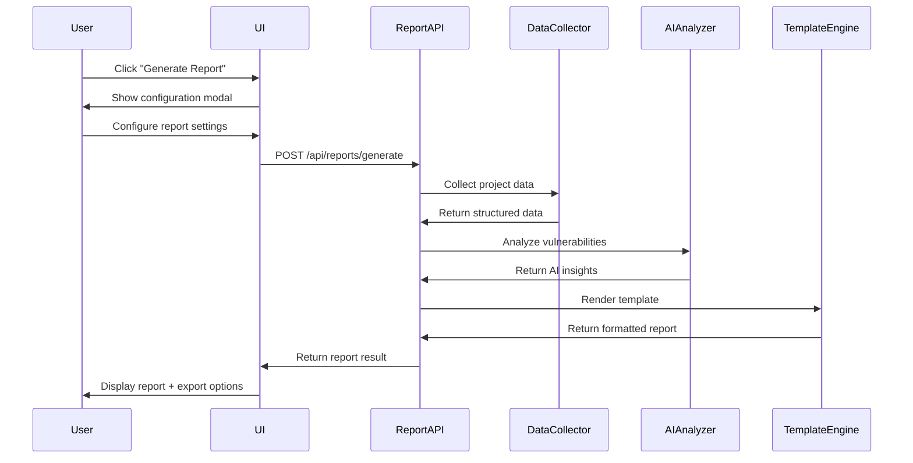

# Design Document

## Overview

Le système de génération automatique de rapports de pentest s'intègre parfaitement dans l'architecture existante de BCI Tool v2. Il exploite la mémoire adaptative, le système d'apprentissage automatique, et les données hiérarchiques pour créer des rapports professionnels et intelligents.

## Architecture

### Integration avec l'Existant

Le système s'appuie sur les services déjà implémentés :
- **LearningSystem** : Pour analyser les patterns de succès/échec et générer des métriques
- **AdaptiveMemory** : Pour rechercher et organiser le contenu pertinent via RAG
- **PentestingPrompts** : Pour contextualiser et enrichir les analyses
- **API Unified** : Pour accéder aux données hiérarchiques (Sections → Dossiers → Tableaux)

### Architecture du Service de Rapports



## Components and Interfaces

### 1. ReportGenerator Service

```typescript
interface ReportGenerator {
  generateReport(config: ReportConfig): Promise<ReportResult>
  getAvailableTemplates(): ReportTemplate[]
  previewReport(config: ReportConfig): Promise<ReportPreview>
  exportReport(reportId: string, format: 'pdf' | 'markdown'): Promise<Buffer>
}

interface ReportConfig {
  projectId: string
  templateId: string
  sections: ReportSection[]
  metadata: {
    clientName: string
    pentesterName: string
    testPeriod: { start: Date; end: Date }
    scope: string[]
  }
  filters: {
    includeSections?: string[]
    severityLevels?: ('critical' | 'high' | 'medium' | 'low')[]
    dateRange?: { start: Date; end: Date }
  }
}
```

### 2. Data Collection Layer

```typescript
interface DataCollector {
  collectVulnerabilities(projectId: string, filters: DataFilters): Promise<Vulnerability[]>
  collectSuccessPatterns(projectId: string): Promise<SuccessPattern[]>
  collectFailureAnalysis(projectId: string): Promise<FailureAnalysis[]>
  collectMetrics(projectId: string): Promise<ProjectMetrics>
}

interface Vulnerability {
  id: string
  title: string
  severity: 'critical' | 'high' | 'medium' | 'low'
  description: string
  impact: string
  remediation: string
  evidence: Evidence[]
  discoveredAt: Date
  technique: string
  context: string
}
```

### 3. Template Engine

```typescript
interface TemplateEngine {
  renderTemplate(template: ReportTemplate, data: ReportData): Promise<string>
  registerTemplate(template: ReportTemplate): void
  getTemplate(templateId: string): ReportTemplate
}

interface ReportTemplate {
  id: string
  name: string
  description: string
  sections: TemplateSection[]
  styling: TemplateStyle
  metadata: TemplateMetadata
}
```

### 4. AI Analysis Integration

```typescript
interface AIAnalyzer {
  analyzeVulnerabilities(vulnerabilities: Vulnerability[]): Promise<VulnerabilityAnalysis>
  generateExecutiveSummary(data: ReportData): Promise<string>
  generateRecommendations(patterns: SuccessPattern[], failures: FailureAnalysis[]): Promise<string[]>
  assessRiskLevel(vulnerabilities: Vulnerability[]): Promise<RiskAssessment>
}
```

## Data Models

### Report Data Structure

```typescript
interface ReportData {
  metadata: {
    projectId: string
    clientName: string
    pentesterName: string
    generatedAt: Date
    testPeriod: { start: Date; end: Date }
    scope: string[]
  }
  
  executiveSummary: {
    overview: string
    keyFindings: string[]
    riskLevel: 'low' | 'medium' | 'high' | 'critical'
    recommendationSummary: string
  }
  
  vulnerabilities: Vulnerability[]
  
  metrics: {
    totalVulnerabilities: number
    severityBreakdown: Record<string, number>
    testCoverage: number
    timeSpent: number
    techniquesUsed: string[]
  }
  
  learningInsights: {
    successPatterns: SuccessPattern[]
    failureAnalysis: FailureAnalysis[]
    recommendations: string[]
    futureOptimizations: string[]
  }
  
  appendices: {
    methodology: string
    toolsUsed: string[]
    references: string[]
  }
}
```

### Template System

```typescript
interface TemplateSection {
  id: string
  title: string
  type: 'text' | 'table' | 'chart' | 'list' | 'ai-generated'
  required: boolean
  dataSource: string
  formatting: SectionFormatting
}

interface ReportTemplate {
  id: string
  name: string
  type: 'executive' | 'technical' | 'compliance'
  sections: TemplateSection[]
  aiPrompts: {
    executiveSummary: string
    recommendations: string
    riskAssessment: string
  }
}
```

## Error Handling

### Validation Layer

```typescript
interface ReportValidator {
  validateConfig(config: ReportConfig): ValidationResult
  validateData(data: ReportData): ValidationResult
  validateTemplate(template: ReportTemplate): ValidationResult
}

interface ValidationResult {
  isValid: boolean
  errors: ValidationError[]
  warnings: ValidationWarning[]
}
```

### Error Recovery

- **Données manquantes** : Utilisation de valeurs par défaut et signalement dans le rapport
- **Échec de génération AI** : Fallback vers templates statiques
- **Erreurs de format** : Génération en mode dégradé avec sections disponibles
- **Timeout** : Génération asynchrone avec notification de progression

## Testing Strategy

### Unit Tests

```typescript
describe('ReportGenerator', () => {
  test('should generate executive summary report', async () => {
    const config = createMockReportConfig('executive')
    const result = await reportGenerator.generateReport(config)
    expect(result.success).toBe(true)
    expect(result.sections).toContain('executiveSummary')
  })
  
  test('should handle missing vulnerability data gracefully', async () => {
    const config = createMockReportConfig('technical')
    mockDataCollector.collectVulnerabilities.mockResolvedValue([])
    const result = await reportGenerator.generateReport(config)
    expect(result.warnings).toContain('No vulnerabilities found')
  })
})
```

### Integration Tests

```typescript
describe('Report Integration', () => {
  test('should integrate with learning system for insights', async () => {
    const projectId = 'test-project'
    const patterns = await learningSystem.getTopPatterns()
    const report = await reportGenerator.generateReport({
      projectId,
      templateId: 'technical',
      sections: ['learningInsights']
    })
    expect(report.data.learningInsights.successPatterns).toEqual(patterns)
  })
})
```

### End-to-End Tests

- Test complet de génération de rapport avec données réelles
- Validation des formats PDF et Markdown
- Test de performance avec gros volumes de données
- Test d'intégration avec tous les services existants

## API Endpoints

### Report Generation API

```typescript
// POST /api/reports/generate
interface GenerateReportRequest {
  projectId: string
  templateId: string
  config: ReportConfig
}

// GET /api/reports/templates
interface GetTemplatesResponse {
  templates: ReportTemplate[]
}

// GET /api/reports/{reportId}/export/{format}
// Returns: PDF Buffer or Markdown string

// POST /api/reports/preview
interface PreviewReportRequest {
  projectId: string
  templateId: string
  sections: string[]
}
```

### Template Management API

```typescript
// GET /api/reports/templates/{templateId}
// POST /api/reports/templates (admin only)
// PUT /api/reports/templates/{templateId} (admin only)
// DELETE /api/reports/templates/{templateId} (admin only)
```

## Performance Considerations

### Caching Strategy

- **Template Cache** : Templates compilés en mémoire
- **Data Cache** : Cache des données de projet avec TTL
- **AI Response Cache** : Cache des analyses AI pour éviter les re-calculs

### Optimization

- **Lazy Loading** : Chargement des sections à la demande
- **Streaming** : Génération progressive pour gros rapports
- **Background Processing** : Génération asynchrone avec WebSocket pour le statut

### Scalability

- **Queue System** : File d'attente pour les générations de rapports
- **Resource Limits** : Limitation du nombre de rapports simultanés
- **Cleanup** : Suppression automatique des rapports temporaires

## Security Considerations

### Access Control

- **Project Isolation** : Accès uniquement aux données du projet autorisé
- **Role-Based Access** : Différents niveaux d'accès selon le rôle
- **Audit Logging** : Traçabilité de toutes les générations de rapports

### Data Protection

- **Sensitive Data Filtering** : Masquage automatique des données sensibles
- **Export Controls** : Validation des permissions avant export
- **Temporary Files** : Nettoyage sécurisé des fichiers temporaires

## Integration Points

### Existing Services Integration

1. **Memory Service** : Récupération du contenu via recherche sémantique
2. **Learning System** : Analyse des patterns et métriques d'efficacité
3. **Unified API** : Accès aux données hiérarchiques structurées
4. **Claude AI** : Génération de contenu intelligent et contextuel

### UI Integration

- **Sidebar Action** : Bouton "Générer Rapport" dans la navigation
- **Modal Configuration** : Interface de configuration des rapports
- **Progress Tracking** : Indicateur de progression en temps réel
- **Preview Mode** : Prévisualisation avant génération finale

### Workflow Integration



Cette architecture s'intègre parfaitement avec votre système existant tout en ajoutant une valeur significative pour automatiser la documentation des tests de sécurité.